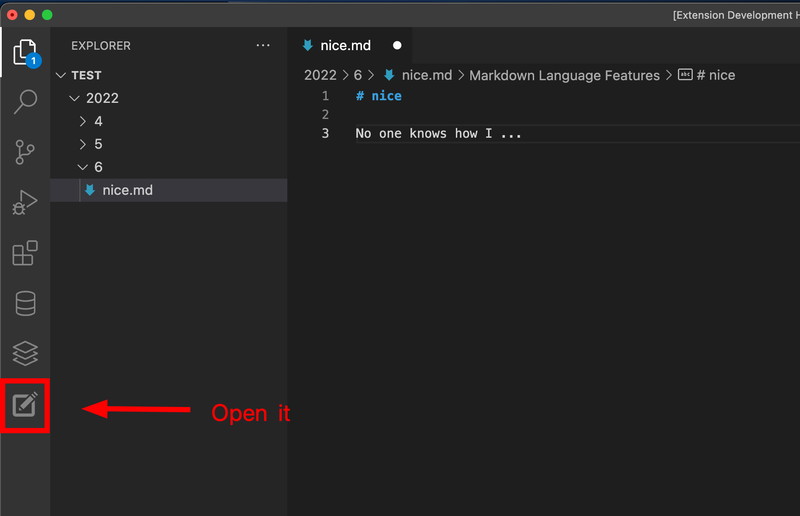

# VScode Diary

Made by yingshaoxo with love.

https://marketplace.visualstudio.com/items?itemName=yingshaoxo.vscode-diary

### How to use

### How to dev

- Open this example in VS Code Insiders
- `npm install`
- `npm run watch`
- `F5` to start debugging
- Node dependencies view is shown in Package explorer view container in Activity bar.
- FTP file explorer view should be shown in Explorer
